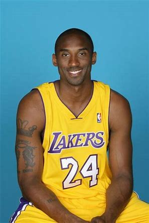
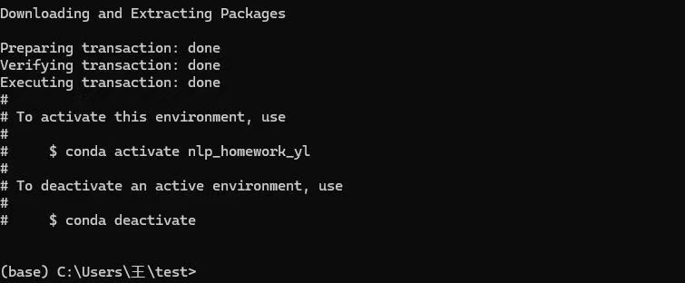
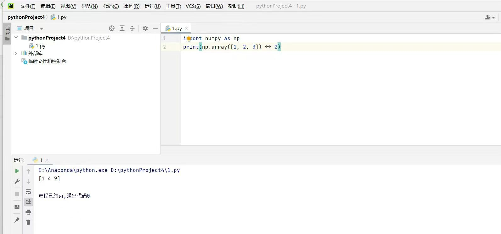

# 牢大的自我介绍
大家好，我是**kobe Bryant**住在美国加利福利亚洛杉矶县的**直升机**里面，以下是我的自我介绍
# 基础档案

### 外貌特征
- 我是一个**飞行员**，我喜欢飞翔在蓝天上，享受自由坠机的感觉。
- 拥有牢大的称号
- 喜欢肘击对手
### 重要坐标和个人信息
**住址** 美国洛杉矶县
**出生地** 美国宾夕法尼亚州费城
**出生日期** 1978年8月23日
**身高** 198cm
### 个人作息表
| 时间    |  事项   |          收获 |
|:------|:-----:|------------:|
| 9-18  | 练习肘击  |   提升了打篮球的技巧 |
| 18-24 | 练习开飞机 | 重生之我在洛杉矶开飞机 |

# 人生格言
man ,what can i say ,MAMBA back!
### 作业一截图

### 作业二截图

